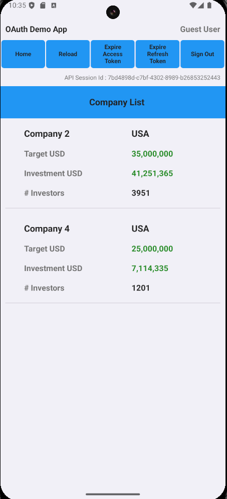
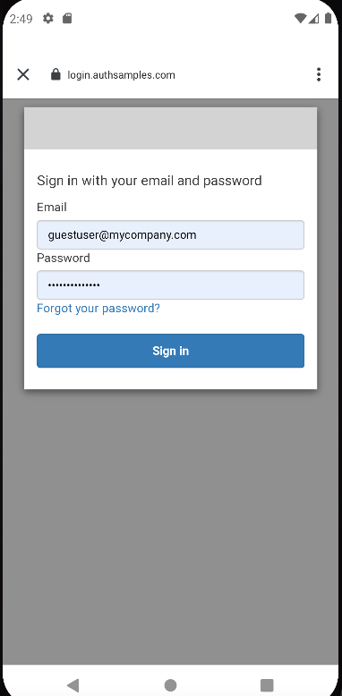

# Android OAuth Mobile Sample

[](https://app.codacy.com/gh/gary-archer/oauth.mobilesample.android?utm_source=github.com&utm_medium=referral&utm_content=gary-archer/oauth.mobilesample.android&utm_campaign=Badge_Grade)

## Overview

A demo mobile app using OpenID Connect, which aims for the best usability and reliability.

## Views

The app is a simple UI with some basic navigation between views, to render fictional investment resources.\
Its data is returned from an OAuth-secured API that uses claims-based authorization.\
The app uses user attributes from both the OpenID Connect userinfo endpoint and its API. 



## Local Development Quick Start

Open the app in Android Studio and run the app on an emulator or device.\
This triggers an OpenID Connect code flow to authenticate the user with the AppAuth pattern.\
Logins run in a `Chrome Custom Tab` browser and the app cannot access the user's credentials:



You can sign in to the app using my AWS Cognito test account:

```text
- User: guestuser@example.com
- Password: GuestPassword1
```

The app receives the login response using a claimed HTTPS scheme redirect URI, in the most secure way.\
Android App Links enables an HTTPS redirect URI and requires a cloud hosted deep linking assets file.\
External web pages ensure a user gesture after login and logout, to reliably return responses to the app.\
After login you can test all lifecycle operations, including token refresh, expiry events and logout.

## Further Information

* See the [API Journey - Client Side](https://github.com/gary-archer/oauth.blog/tree/master/public/posts/api-journey-client-side.mdx) for further information on the app's behaviour.
* See blog posts for further details specific to the Android app, starting in the [Code Sample Overview](https://github.com/gary-archer/oauth.blog/tree/master/public/posts/android-code-sample-overview.mdx).

## Programming Languages

* The app's code uses Kotlin and its views use Jetpack Compose.

## Infrastructure

* [AppAuth-Android](https://github.com/openid/AppAuth-Android) implements the code flow with PKCE.
* [AWS Serverless](https://github.com/gary-archer/oauth.apisample.serverless) or Kubernetes host remote API endpoints that the app calls.
* AWS Cognito is the default authorization server for the mobile app and API.
* Android shared preferences stores tokens on the device and isolates this data from other apps.
* AWS S3 and Cloudfront serve mobile deep linking asset files and external web pages that receive login responses.
