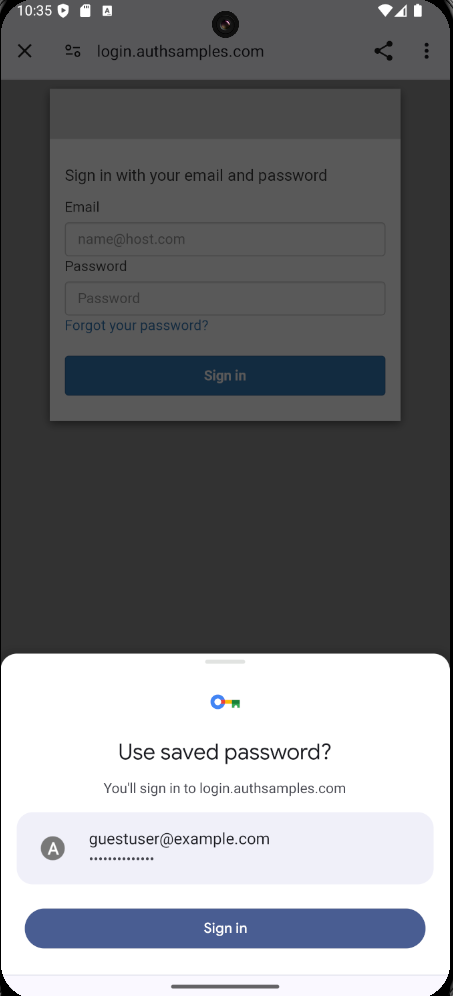

# Android OAuth Mobile Sample

[](https://app.codacy.com/gh/gary-archer/oauth.mobilesample.android?utm_source=github.com&utm_medium=referral&utm_content=gary-archer/oauth.mobilesample.android&utm_campaign=Badge_Grade)

## Overview

* A mobile sample using AppAuth and OpenID Connect, referenced in my blog at https://authguidance.com
* **The goal is to implement OpenID Connect mobile logins with best usability and reliability**

## Views

The app is a simple UI with some basic navigation between views, to render fictional resources.\
The data is returned from an API that authorizes access to resources using claims from multiple sources.


## Local Development Quick Start

Open the app in Android Studio and run the app on an emulator or device.\
This will trigger an OpenID Connect login flow using the AppAuth pattern.\
The login runs in the system browser using a `Chrome Custom Tab`.\
This ensures that the app cannot access the user's credentials:



You can login to the app using my AWS Cognito test account:

```text
- User: guestuser@mycompany.com
- Password: GuestPassword1
```

An HTTPS redirect URI of `https://mobile.authsamples.com/basicmobileapp/oauth/callback` is used.\
Deep links are then used to receive the login response, in the most secure way.\
A deep linking assets file is registered at https://mobile.authsamples.com/.well-known/assetlinks.json. \
Interstitial web pages ensure a user gesture after login and logout, so that return to the app is reliable.\
After login you can test all lifecycle operations, including token refresh, expiry events and logout.

## Further Information

* See the [API Journey - Client Side](https://authguidance.com/api-journey-client-side/) for further information on the app's behaviour
* Further details specific to the Android app are provided, starting in the [Code Sample Overview](https://authguidance.com/android-code-sample-overview/) blog post

## Programming Languages

* Kotlin and Jetpack Compose are used to develop an app that connects to a Cloud API and Authorization Server

## Infrastructure

* [AppAuth-Android](https://github.com/openid/AppAuth-Android) is used to implement the Authorization Code Flow (PKCE) with a Claimed HTTPS Scheme
* [AWS Serverless](https://github.com/gary-archer/oauth.apisample.serverless) or Kubernetes is used to host remote API endpoints used by the app
* AWS Cognito is used as the default Authorization Server for the Mobile App and API
* Android Shared Preferences is used for private storage of tokens on the device after login
* AWS S3 and Cloudfront are used to serve mobile deep linking asset files and interstitial web pages
